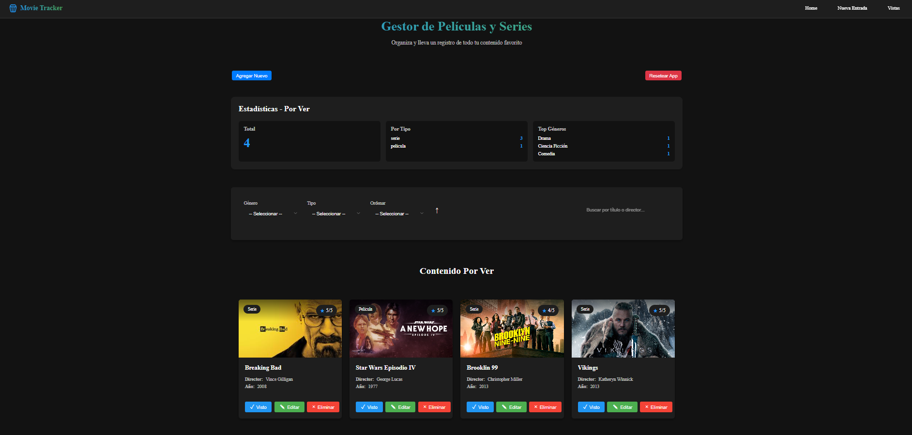
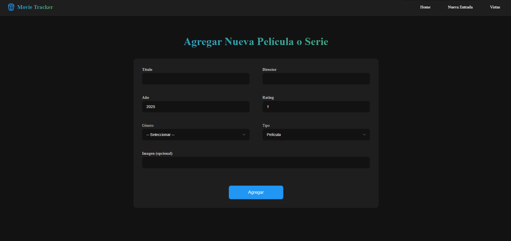
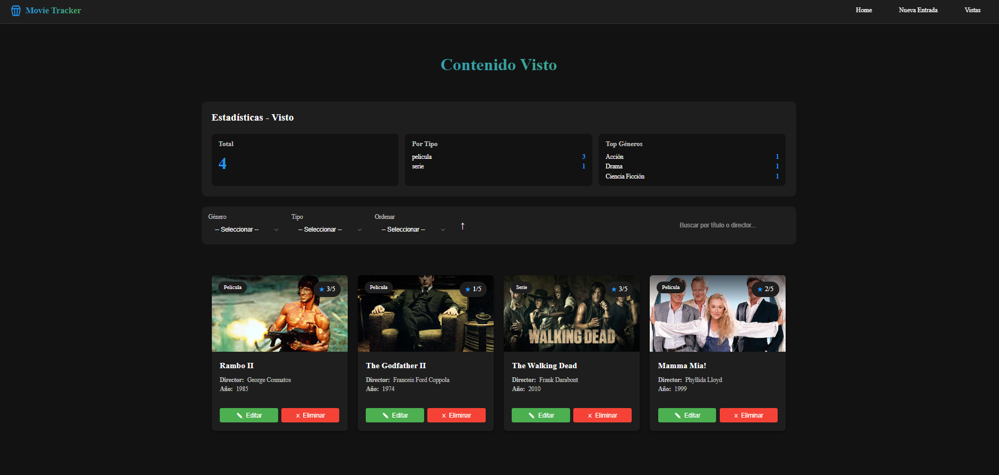
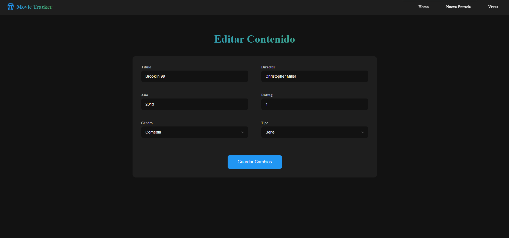

# 🎬 Movie Tracker

## 👥 Integrantes del Grupo
- Hernandez Martín FAI-4433
- Metzger German FAI-3521
- Bucarey Mateo FAI- 4319

## 📝 Descripción
Movie Tracker es una aplicación web desarrollada con React que permite gestionar y hacer seguimiento de películas y series. Los usuarios pueden:

- Agregar nuevas películas y series a su lista "Por Ver"
- Marcar contenido como visto
- Filtrar por género, tipo de contenido (película/serie) y búsqueda por título/director
- Ordenar por año o rating
- Ver estadísticas de su contenido
- Editar o eliminar entradas
- Persistencia de datos en localStorage

## 🚀 Tecnologías Utilizadas
- React
- TypeScript
- CSS Modules
- LocalStorage para persistencia de datos
- Lucide React (Iconos)
- React Router DOM (Rutas)
- UUID (Generación de IDs)

## ⚙️ Instalación

1. Clonar el repositorio:
```bash
git clone [URL_DEL_REPOSITORIO]
cd TP-React-PWA
```

2. Instalar dependencias:
```bash
npm install
```

3. Iniciar la aplicación en modo desarrollo:
```bash
npm run dev
```

La aplicación estará disponible en `http://localhost:5173`

### Página Principal

*Vista principal con lista de contenido y filtros*

### Agregar Nuevo Contenido

*Formulario para agregar nueva película o serie*

### Contenido Visto

*Lista de contenido marcado como visto*

### Editar Contenido 

*Edición de contenido*

## 🎯 Características Principales

### Sistema de Filtros
- Búsqueda por título o director
- Filtrado por género
- Filtrado por tipo (película/serie)
- Ordenamiento por año o rating

### Gestión de Contenido
- Agregar nuevas películas/series
- Marcar como visto
- Editar entradas existentes
- Eliminar contenido

### Estadísticas
- Total de contenido
- Distribución por género
- Distribución por tipo

## 💾 Persistencia de Datos
La aplicación utiliza localStorage para mantener los datos guardados incluso después de cerrar el navegador. Los datos se sincronizan automáticamente.

## 🔄 Estado de la Aplicación
- ✅ Todas las funcionalidades principales implementadas
- ✅ Interfaz intuitiva y amigable
- ✅ Persistencia de datos
- ✅ Manejo de errores

## 🎨 Diseño
- Interfaz moderna y minimalista
- Tema oscuro para mejor experiencia visual
- Animaciones y transiciones suaves
- Feedback visual para todas las acciones

## 📚 Estructura del Proyecto
```
src/
├── components/     # Componentes reutilizables
├── pages/         # Páginas principales
├── types/         # Definiciones de TypeScript
├── utils/         # Utilidades y helpers
└── styles/        # Estilos globales
```

### Desarrollo del TP-React de la materia Programación Web Avanzada
